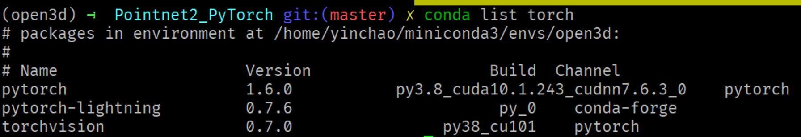

- [TODOs](#todos)
- [1.explore](#1explore)
  - [quick run scripts](#quick-run-scripts)
  - [code structure](#code-structure)
  - [run code](#run-code)
    - [set up env](#set-up-env)
  - [code profiling](#code-profiling)
    - [configuring w. hydra](#configuring-w-hydra)
    - [dataset and dataloaders](#dataset-and-dataloaders)
    - [CUDA ops](#cuda-ops)
    - [model](#model)
    - [training and evaluate](#training-and-evaluate)
    - [visualization](#visualization)
  - [FAQ](#faq)
      - [how to use C++ code in python?](#how-to-use-c-code-in-python)
- [2.exploitation](#2exploitation)
  - [replicate PointNet2 using pytorch](#replicate-pointnet2-using-pytorch)
  - [hyper-parameter tuning](#hyper-parameter-tuning)
  - [ablation study](#ablation-study)


# TODOs


# 1.explore

invovles: code structure, run code, code profiling, quick run scipts

## quick run scripts

**cls**

```
python pointnet2/train.py task=cls

# Or with model=msg for multi-scale grouping
python pointnet2/train.py task=cls model=msg
python pointnet2/train.py task=cls gpus=[0,1,2,3]
```

**semseg**

```
python pointnet2/train.py task=semseg
python pointnet2/train.py task=semseg gpus=[0,1,2,3]
```
## code structure

```
--misc, dataset names and ids, images
--pointnet2
  --config
    --model, ssg and msg yaml config
    --task, cls and semseg task yaml config
    --task_model, different type model config(4 types)
    --config.yaml, current model config, define which model to use and other settings.
  --data
    --data_utils.py
    --Indoor3DSemSegLoader.py
    --ModelNet40Loader.py
  --models, **4 pointnet2 modles**
  --utils
  --train.py, main file for training and evaluating
--pointnet2_ops_lib, c++ custom operations
  --pointnet2_ops
--tests, unit test code for semseg, cls and config
  --conftest.py
  --test_cls.py
  --test_semseg.py
--setup.py, declare dependencies for this py module.
```

## run code

- Require to use CUDA10.1+pytorch1.4+; 
- I used open3d conda env on Ubuntu, which install py3.8, pytorch 1.6+cuda 10.1. (Note: my ubuntu is nvcc 10.1 and nvidia driver 11.2)
 

### set up env

**1.install conda packages and custom CUDA ops**
- intall all packages listed in requirement.txt using conda; 
- note: we did not use pip to install pakcages, since it reported an error `can not find source`, so we switch conda way and it worked well.

```
conda install -c anaconda msgpack-numpy -y
conda install -c conda-forge python-lmdb -y
conda install -c anaconda h5py -y
conda install -c conda-forge hydra-core=0.11 -y
conda install -c conda-forge pytorch-lightning=0.7 -y

# this step might encounter compilation error, check below for details
# install custom ops (require cuda 10.1) 
pip3 install pointnet2_ops_lib/.
```

note: the above script is talled in requirements-install.sh

**(optional) 2.address CUDA ops compilation problem**

- cause: mine CUDA nvcc version(9.1) is incompatible w. pytorch cuda version(10.1), so the solution is 1) make sure that my nvcc version should at least 10.1 cuda version based the software backward compatibility principle, or 2)downgrade pytorch cuda version to 9.1, however this is not suggested.

- sol: upgrade CUDA 9.1 to 10.1; **for details, check my wiznote for upgrading CUDA, the process is not complicated using scripting.**. Then you should be able compile cuda ops succesfully.

**3.run code on modelnet or s3dis datasets**
check quick run scripts.


## code profiling

### configuring w. hydra
- hydra is excellent configuration lib which enable u to compose complex configs(hierarchical settings) w. ease. check my notes on Code.docx
- train.py's main function's property will load the config.yaml file; check my notes on Code.docx

### dataset and dataloaders
- s3dis;sim. to orginal pointnet's way, need preprocess the raw point clouds (txt-->npy-->h5 fiels)
- modelnet; sim. to orginal pointnet's way.

### CUDA ops
check notes on Code.docx

### model
check notes on Code.docx


### training and evaluate
check notes on Code.docx

### visualization
- show_cls.py
- show_seg.py
- show3d_balls.py

## FAQ

#### how to use C++ code in python?
- cpp code(render_ballsx.cpp)
- compile using c++ compiler to get .so file(build.sh)
- load the .so file, then use call yr desired functions in .so(show3d_balls.py)


# 2.exploitation
## replicate PointNet2 using pytorch

## hyper-parameter tuning

## ablation study
